

<table>
    <theader>
        <tr>
            <td></td>
            <th>
                UNIVERSIDAD NACIONAL DE SAN AGUSTIN 
                FACULTAD DE INGENIERÍA DE PRODUCCIÓN Y SERVICIOS 
                DEPARTAMENTO ACADÉMICO DE INGENIERÍA DE SISTEMAS E INFORMÁTICA 
                ESCUELA PROFESIONAL DE INGENIERÍA DE SISTEMAS
            </th>
            <td></td>
        </tr>
    </theader>
    <tbody>
        <tr><td colspan="3">Formato: Guía de Práctica de Laboratorio</td></tr>
        <tr><td>Aprobación:  2022/03/01</td><td>Código: GUIA-PRLD-001</td><td>Página: 1</td></tr>
    </tbody>
</table>

GUÍA DE LABORATORIO 

<table>
<theader>
<tr><th colspan="6">INFORMACIÓN BÁSICA</th></tr>
</theader>
<tbody>
<tr><td>ASIGNATURA:</td><td colspan="5">Programación Web 2</td></tr>
<tr><td>TÍTULO DE LA PRÁCTICA:</td><td colspan="5">Python</td></tr>
<tr>
<td>NÚMERO DE PRÁCTICA:</td><td>04</td><td>AÑO LECTIVO:</td><td>2023 A</td><td>NRO. SEMESTRE:</td><td>III</td>
</tr>
<tr>
<td>FECHA DE PRESENTACION:</td><td>05/06/2023</td><td>HORA DE PRESENTACION:</td><td></td>
</tr>
<tr><td colspan="6">INTEGRANTE(S):
    <ul>
        <li>Chara Condori Jean Carlo</li>
    </ul>
</td>
</<tr>
<tr><td colspan="6">DOCENTE(s):
<ul>
<li>Mg. Anibal Sardon Paniagua</li>
</ul>
</td>
</<tr>
</tdbody>
</table>

# Python

## EJERCICIOS PROPUESTOS

- Para resolver los siguientes ejercicios sólo está permitido usar ciclos, condicionales, definición de listas por
comprensión, sublistas, map, join, (+), lambda, zip, append, pop, range.
• Implemente los metodos de la clase Picture.
Se recomienda que implemente la clase picture por etapas, probando realizar los dibujos que se muestran en
las siguientes preguntas.
• Usando únicamente los métodos de los objetos de la clase Picture dibuje las siguientes figuras (invoque a
draw):

- REPOSITORIO GITHUB: https://github.com/JeanChara/pweb2_lab04

- Código clase picture: 
    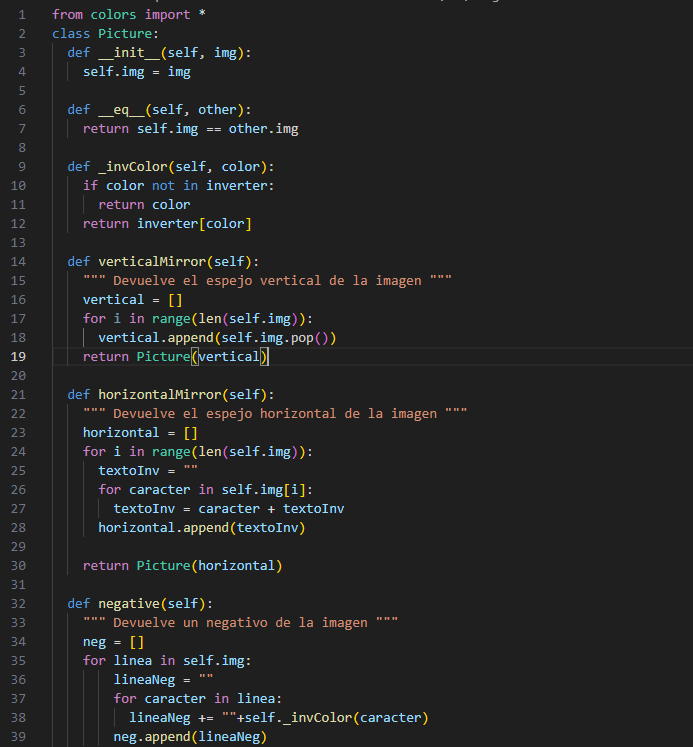
    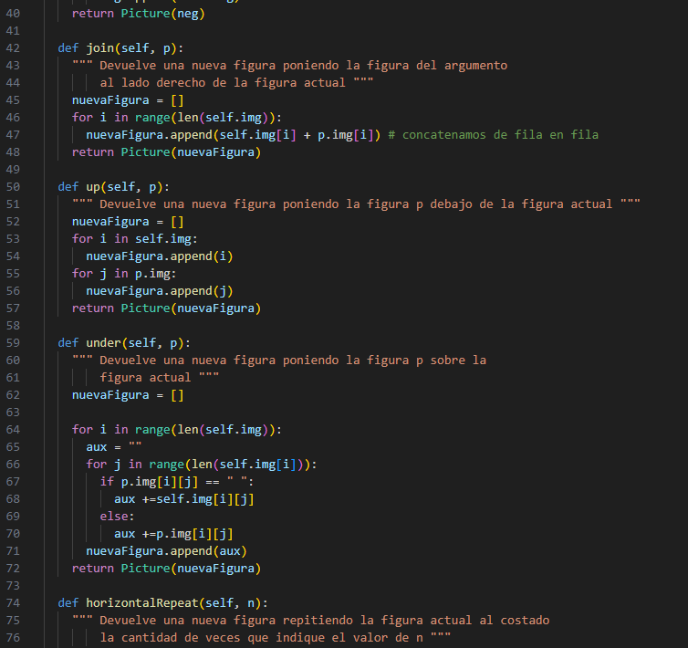
    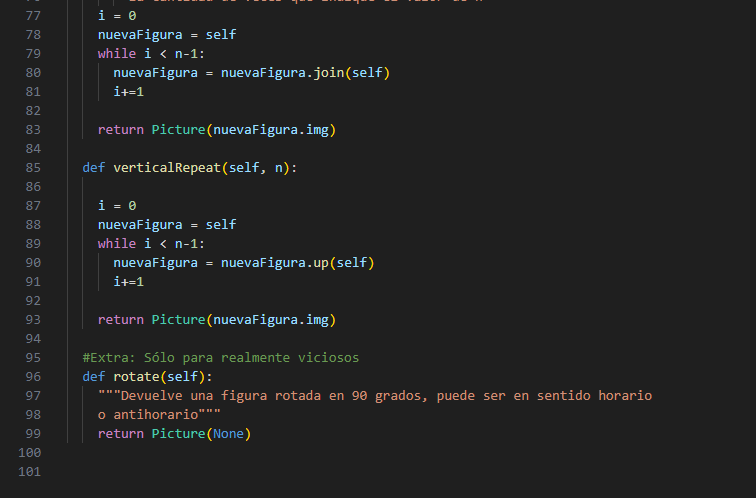
    
    - Ejercicio2a (1): 

    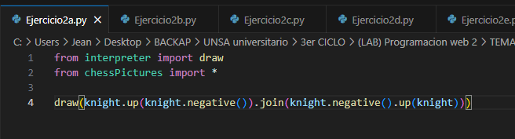

    - Utilizamos la función negative para hallar el color inverso de nuestra pieza, la función up para colocar
        nuestra pieza arriba de la otra, y la función join para unir estas piezas.
        Colocamos al caballo blanco encima de nuestro caballo negro, una vez realizado esto, la unimos con
        la otra columna(caballo negro sobre caballo blanco). 

    **- Ejecucion:**

    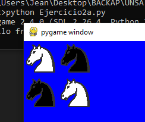

    - Ejercicio2b (2): 

    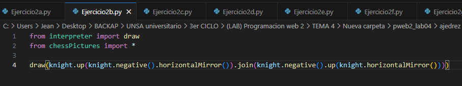

    - En este ejercicio añadimos la función horizontalMirror(), la cual cambiara de dirección a nuestra
        pieza, haciendo que mire hacia el otro lado. Al igual que el ejercicio2a (1), creamos nuestros
        caballos, los colocamos en columnas y los unimos. 

    **- Ejecucion:**

    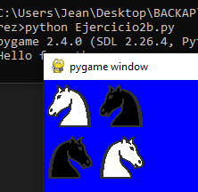
    

    - Ejercicio2c (3): 

    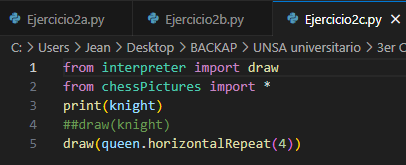

    - En este ejercicio creamos la función horizontalRepeat, la cual repetirá nuestra pieza un numero
        determinado de veces, esta función concatena a las piezas, haciendo que se coloquen una al
        costado de otra (izquierda a derecha).

    **- Ejecucion:**

    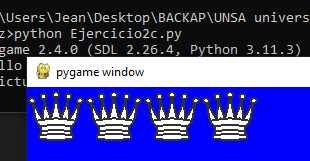

        - Ejercicio2d (4): 

    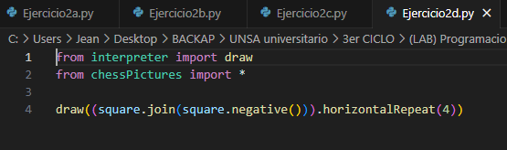

    - En este ejercicio se nos pide crear una fila de un tablero de ajedrez, por lo que creamos los 2
        primeros cuadrados (blanco y negro) y los repetimos 4 veces, para crear una fila con 8 elementos.  

    **- Ejecucion:**

    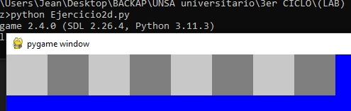

        - Ejercicio2e (5): 

    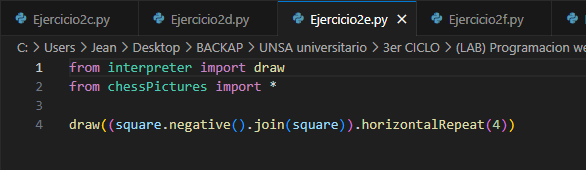

    - Al igual que el anterior (Ejercicio2d), se nos pide crear una fila de cuadrados, solo que el orden de los
        cuadrados es diferente (negro y blanco).  

    **- Ejecucion:**

    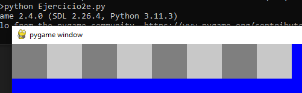

        - Ejercicio2f (6): 

    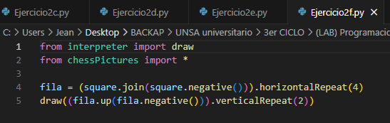

    - Se crea la función verticalRepeat, la cual al igual que horizontalRepeat, creara varias veces un
        elemento o pieza, pero en columna, es decir, repetirá n veces el elemento hacia abajo.
        En este ejercicio se nos pide crear 4 filas intercaladas de cuadrados, por lo que creamos la variable
        fila, la cual almacenara una fila intercalada de cuadrados (iniciando con el blanco), luego, lo
        colocamos encima de nuestra fila con color negativo, utilizando la función verticalRepeat, lo
        haremos 2 veces para asi crear 4 filas, puesto que repite 2 veces la creación de 2 filas. 
 
    **- Ejecucion:**

    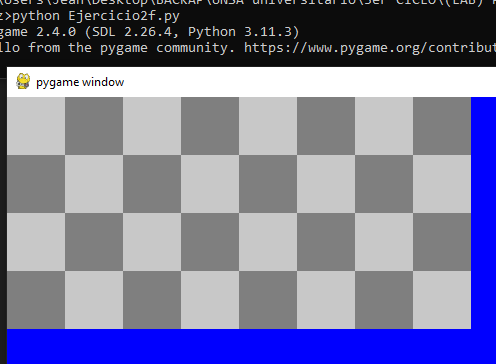

        - Ejercicio2g (7): 

    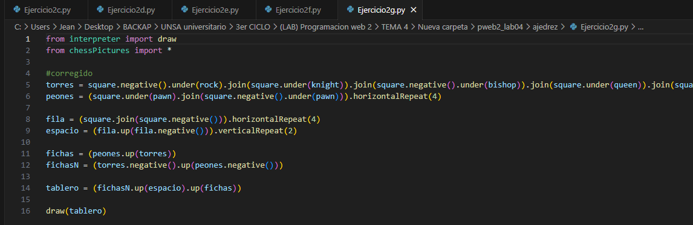

    - En este ejercicio se nos pide crear un tablero de ajedrez.
        Creamos la variable torres, la cual concatenara con join a todas las piezas en orden de juego, estas
        piezas se encuentran superpuestas a los cuadros respectivos, intercalando de color.
        Seguidamente creamos la variable peones, la cual creara con horizontalRepeat la fila de peones.
        Creamos la variable fila, la cual almacenara una fila de cuadros, repitiéndose 4 veces para llegar a 8
        elementos, luego en la variable espacio, la repetimos verticalmente 2 veces.
        Creamos las variables fichas y fichasN, las cuales almacenaran el orden de piezas para las fichas
        negras y blancas respectivamente, se utiliza la funcion up y negative para el orden y color.
        Finalmente, unimos las variables en la variable tablero, la cual colocara primero las fichas negras,
        luego el espacio y finalmente las fichas blancas. 

    **- Ejecucion:**

    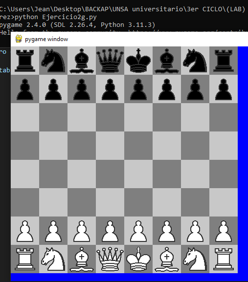

## SOLUCIÓN DEL CUESTIONARIO
- Explique: ¿Para qué sirve el directorio pycache? 
    
    Almacena el código utilizado por Python para almacenar caché, se utiliza con el propósito de
    aumentar el rendimiento de los scripts.
    Cuando se ejecuta un modulo mas de una vez, en lugar de compilar de nuevo, se busca el caché, en
    caso de encontrarse, se utiliza este mismo para ejecutarse de forma rápida. 

**III. CONCLUSIONES**

- Se utilizo módulos o “librerías” de Python (pygame) para la correcta realización de la práctica. Se ha practicado los temas en Python relacionados a objetos, métodos, funciones, arreglos (listas), ciclos, condicionales, entre otros aspectos básicos con el fin de reforzar nuestro conocimiento del mismo

**RETROALIMENTACIÓN GENERAL**

- REPOSITORIO GITHUB: https://github.com/JeanChara/pweb2_lab04

**REFERENCIAS Y BIBLIOGRAFÍA**
- [https://docs.python.org/3/library/array.html?highlight=pop#array.array.pop](https://docs.python.org/3/library/array.html?highlight=pop#array.array.pop)
- [https://docs.python.org/3/tutorial/introduction.html#lists](https://docs.python.org/3/tutorial/introduction.html#lists)
- [https://docs.python.org/3/glossary.html#term-function](https://docs.python.org/3/glossary.html#term-function)
- [https://docs.python.org/es/3/tutorial/classes.html](https://docs.python.org/es/3/tutorial/classes.html)
#

